# Protocole d’installation du Sigfox
## Table des matières
1. [Bibliographie](#1-bibliographie)
2. [Installation du programme](#2-installation-du-programme)
	1. [Télécharger](#21-télécharger)
	2. [Configurer](#22-configurer)
		1. [Ajouter le noyau SAMD Core](#221-ajouter-le-noyau-samd-core)
		2. [Ajouter les librairies](#222-ajouter-les-librairies)
		3. [Selectionner le type de carte et le port](#223-selectionner-le-type-de-carte-et-le-port)
	3. [Votre premier croquis](#23-votre-premier-croquis)
	4. [Tutoriels](#24-tutoriels)
	5. [Notes importantes](#25-notes-importantes)
3. [Réglage du taux de transfert des données](#3-Réglage-du-taux-de-transfert-des-données)
4. [Création d'un compte SIGFOX](#4-Création-dun-compte-SIGFOX)
5. [Exécutez votre premier programme Arduino en utilisant Sigfox (optionnel)](#5-Exécutez-votre-premier-programme-Arduino-en-utilisant-Sigfox)
	1. [Programmes](#51-Programmes)
	2. [Communication bi-directionelle (Pour les curieux !)](#52-communication-bi-directionelle-pour-les-curieux-)
6. [Préparation](#6-Préparation)
	1. [Récupérer la librairie balance](#61-Récupérer-la-librairie-balance) 
	2. [Récupérer le programme](#62-récupérer-le-programme)
	3. [Préparation de l'étalonnage](#63-Préparation-de-l%C3%A9talonnage)
7. [Etalonnage](#7-Etalonnage)
8. [balance.serviteurs.org](#8-Site-balances)
9. [Configuration du callback sigfox](#9-Configuration-backend-sigfox)
10. [Renouvellement de l’abonnement après un an](#10-Renouvellement-de-labonnement-après-un-an)

## 1. Bibliographie
Dans cette section, différents lien vers des sites internet relatifs au projet

Site officiel arduino 
- https://www.arduino.cc/en/Guide/MKRFox1200
- https://www.arduino.cc/en/software

Tuto en anglais sur l’installation du microcontroller
- https://www.disk91.com/2018/technology/sigfox/introduction-to-arduino-mkrfox1200-part-1/
- https://www.disk91.com/2018/technology/internet-of-things-technology/introduction-to-arduino-mkrfox1200-part-2/

Inscription du micro-controller
- https://buy.sigfox.com/activate/devkit/FR

Backend Sigox : réception des données
- https://backend.sigfox.com/welcome/news

## 2. Installation du programme

Le logicial __Arduino IDE__ (ou simplement __Arduino__) fera l'interface entre votre ordinateur portable et la carte Arduino.
Il permet de:
1) Créer des programme informatique dans le langage C
2) De les téléverser (les "envoyer") vers la carte Arduino
3) Enfin, d'afficher les données que la carte nous renvoie, suite à l'execution du programme C.

Ex: Je créer un programme informatique pour dire à ma carte de faire une action simple "Fait clignoter la LED qui se trouve sur la carte" (cf. [Votre premier croquis](#23-votre-premier-croquis))
1) Je vais écrire ce programme, en utilisant le langage informatique C
2) Une fois crée, je vais le téléverser vers la carte : Je sauvegarde mon programme sur la carte afin que celle-ci l'exécute
3) La carte exécute le programme et peut (ou pas), me renvoyer une information "j'ai fait clignoter la LED"

Dans ce chapitre, nous allons télécharger la version du logiciel correspondant à notre système informatique.
Nous allons le configurer afin qu'il puisse échanger correctement le(s) programme(s) vers la carte Arduino.
Enfin, nous allons préparer le logiciel, en installant différent composants spécifiques à notre carte Arduino (MKRFox1200), ainsi qu'aux différents programme que nous allons avoir besoin dans la suite du tutoriel.

### 2.1 Télécharger

Vous pouvez télécharger le logiciel __Arduino IDE__ de deux façons:
- Depuis le site https://www.arduino.cc/en/software (Attention de ne __pas__ prendre la version Windows App pour 8.1 / 10)
- Choisir votre programme selon votre système (/!\ Attention, les liens ci-dessous ne sont peut-être plus à jour):
	- Windows 7: [Executable (.exe)](https://downloads.arduino.cc/arduino-1.8.13-windows.exe) ou [Archive (.zip)](https://downloads.arduino.cc/arduino-1.8.13-windows.zip)
	- [Linux 64 bits](https://downloads.arduino.cc/arduino-1.8.13-linux64.tar.xz)
	- [Mac OS X](https://downloads.arduino.cc/arduino-1.8.13-macosx.zip) (10.10 ou plus récent)
 
### 2.2 Configurer
#### 2.2.1 Ajouter le noyau SAMD Core
Afin que le logiciel __Arduino IDE__ puisse échanger avec la carte MKRFox1200, il est indispenable qu'ils parlent la même langue.
Pour ce faire, il faut ajouter au logiciel un noyau correspondant au type de carte "MKRFox1200" : le noyau __SAMD Core__. 

Une fois l'application __Arduino IDE__ installé, 
- selectionner le menu __Outils (Tools)__, 
- puis __Type de cartes (Boards)__,
- __Gestionnaire de cartes (Boards Manager)__
- Rechercher __MKRFox__
- Cliquer sur __Installer__

 

Pour plus d'informations sur les noyaux, consultez le guide sur l'[installation de noyaux Arduino supplémentaires](https://www.arduino.cc/en/guide/cores).

#### 2.2.2 Ajouter les librairies
Maintenant il faut télécharger et installer les librairies que j'ai utilisées pour compiler le programme des balances.
De la même facon que le Noyau permet au logiciel de parler la même langue que la carte, les librairies vont permettent d'étendre les capacités de nos programmes.
Nous pourrons alors faire des taches plus spécifique que "Faire clignoter la carte Arduino", comme "Envoyer un signal via le réseau SigFox".

Les librairies peuvent se télécharger en cliquant sur le lien suivant: [librairies.zip](https://www.dropbox.com/sh/i5s8ciy7g694kg1/AAD1p8ZgO66AvzONasxKT_Pza/libraries/libraries.zip?dl=1) (protégée par mot de passe)

Une fois le fichier d'archive __librairies.zip__ téléchargé (probablement dans votre dossier "Téléchargement"):
- Cliquer droit sur le fichier d'archive __librairies.zip__ et faites extraire le contenu.
- Vous devriez obtenir un dossier nommé _librairies_, qui contient différents sous dossiers (Adafruit_BME280_Library,  Adafruit_BusIO, etc...)
- Copier l'ensemble de ces sous-dossiers dans un emplacement, par exemple dans  __D:\Arduino__ (cf. ci dessous)
- Vous devriez avoir a ce point, dans un dossier (ici __D:\Arduino__) l'ensemble des sous-dossiers cité plus haut. 

Ce dossier, dans le logiciel __Arduino IDE__ est appelé __«Emplacement du carnet de croquis»__

De retour dans le logiciel Aduino IDE; 

- Aller dans __Fichier__ 
- __Préférences__


- Puis coller (ou faire _Parcourir_) le chemin précédent (D:\Arduino) dans le champ __«Emplacement du carnet de croquis»__


Cocher __OK__

Note: En cliquant sur _Parcourir_ vous devriez directement voir les différents sous-dossiers (Adafruit_BME280_Library,  Adafruit_BusIO, etc... dans un dossier __libraries__)

__Les libraires sont maintenant installées.__

Vous devez avoir selon cette exemple quelque chose comme ca : D:\Arduino\libraries (avec les différents répertoires de librairies à l'intérieur)
!!! écrivez bien "libraries" c'est en anglais. 

Si le programme fait une erreur de compilation. Il est possible qu'il faille mettre à jour les __libraries__ . Dans ce cas là aller dans __Outils__ puis __Gérer les bibliothèques__ puis une fenêtre s'ouvre avec l'ensemble des librairies. Dans __Type__ sélectionner __Possible de mettre à jour__. L'ensemble des librairies à mettre à jour seront listé. Cliquer sur __Mise à jour__ pour chacune. Une fois toutes les librairies mise à jour, cliquer sur __Fermer__ . Puis réessayer de compiler.

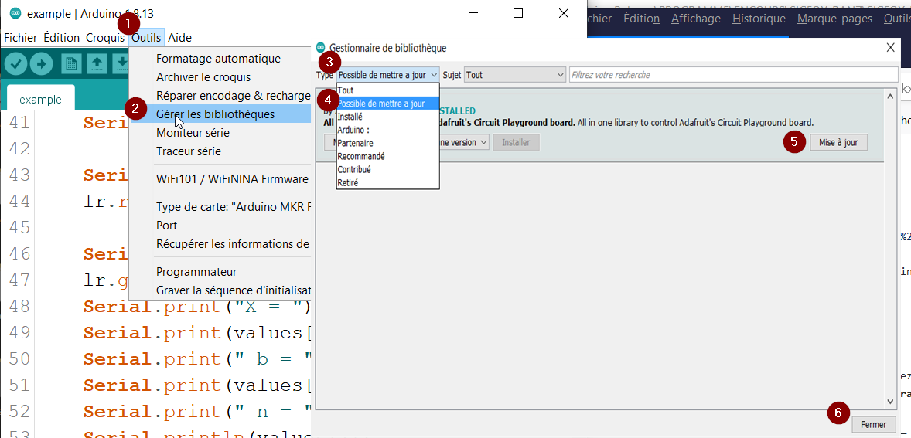

Maintenant que le noyau __SAMD Core__ est installé ainsi que les librairies, vous pouvez connecter la carte à l'ordinateur à l'aide d'un câble USB standard. La toute première fois que votre ordinateur peut passer par le nouveau processus d'installation du matériel.

#### 2.2.3 Selectionner le type de carte et le port
Pour indiquer au logicel __Arduino IDE__ par quel moyen envoyer nos programmes sur la carte, nous devons lui indiquer quel type de carte (Arduino MKRFox1200) grâce au noyau __SAMD Core__ et quel port utiliser, pour ce faire;

Sélectionnez votre type de carte:
- Dans __Outils (Tools)__

- __Type de carte (Boards)__

- Selectionez la carte __Arduino MKRFOX1200__

 

Selectionnez votre port:

- Dans __Outils (Tools)__

- __Port__

- Selectionner le port connecté à votre Arduino MKRFOX1200 (cf [Réglage du taux de transfert des données](#3-Réglage-du-taux-de-transfert-des-données))

 

### 2.3 Votre premier croquis
Un croquis est simplement un programme en langage C, que nous allons envoyer sur la carte, afin que la carte puisse elle-même l'éxecuter.

Ouvrez votre premier croquis __Blink__
Ce croquis fait simplement clignoter la LED intégrée connectée à la broche numérique LED_BUILTIN à un rythme d'une seconde pour allumer et éteindre, mais il est très utile de pratiquer le chargement d'un croquis dans le logiciel Arduino (IDE) et le téléchargement sur la carte connectée.

Toujours dans le logiciel __Arduino IDE__;
- Rendez-vous dans __Fichier__
- puis __Exemple__
- puis sélectionnez __01. Basique__ 
- puis __Blink__

 


Vérifier (1er bouton):
 

Puis Téléverser (2ième bouton ou Ctrl + U) votre premier programme:
 

### 2.4 Tutoriels

Maintenant que vous avez configuré et programmé votre carte MKRFOX1200, vous pouvez trouver l'inspiration dans la [plateforme de didacticiels](https://create.arduino.cc/projecthub?by=part&part_id=40679).

Voici une liste de tutoriels qui vous aideront à faire des choses très cool!

- [SigFox First Configuration](https://www.arduino.cc/en/Tutorial/SigFoxFirstConfiguration)
- [SigFox Event Trigger](https://www.arduino.cc/en/Tutorial/SigFoxEventTrigger)
- [Ajout d'interfaces série supplémentaires aux microcontrôleurs SAMD](https://www.arduino.cc/en/Tutorial/SamdSercom)

Plus d'exemples sur les pages de bibliothèque suivantes:

- [Planificateur](https://www.arduino.cc/en/Reference/Scheduler) - Gérez plusieurs tâches non bloquantes.
- [AudioFrequencyMeter](https://www.arduino.cc/en/Reference/AudioFrequencyMeter) - Échantillonnez un signal audio et récupérez sa fréquence
- [AudioZero](https://www.arduino.cc/en/Reference/AudioZero) - Lisez des fichiers audio à partir d'une carte SD.
- [RTC](https://www.arduino.cc/en/Reference/RTC) - Horloge en temps réel pour planifier des événements.
- [I2S](https://www.arduino.cc/en/Reference/I2S) - Pour connecter des appareils audio numériques ensemble
- [SigFox](https://www.arduino.cc/en/Reference/SigFox) - Pour utiliser la connectivité SigFox

### 2.5 Notes importantes
Dans cette section, nous avons rassemblé des informations qui valent la peine d'être lues pour utiliser correctement votre carte MKRFOX1200. 
Certains comportements diffèrent de la carte Uno et si vous venez d'une expérience antérieure avec cette carte, cela vaut la peine de passer quelques minutes à lire ces notes. 
S'il s'agit de votre premier tableau, nous vous suggérons de les consulter quand même.

__Tension de fonctionnement__
Le microcontrôleur du MKRFOX1200 fonctionne à 3,3 V. L'application de plus de 3,3 V sur n'importe quelle broche endommagera la carte.

__Ports série sur le MKRFOX1200__
Le MKRFOX1200 dispose d'un certain nombre d'installations pour communiquer avec un ordinateur ou d'autres microcontrôleurs. 
Le connecteur USB se présente comme un port série virtuel qui peut être contrôlé en écrivant et en lisant sur l'objet __Serial__. 

Les broches 13/14, à la place, exposent un port série matériel mappé à l'objet __Serial1__. 

L'ouverture et la fermeture du port série USB à un débit en bauds autre que 1200 bps ne réinitialisera pas la carte. 
Pour utiliser le moniteur série et voir ce que fait votre esquisse depuis le début, vous devrez ajouter quelques lignes de code dans la configuration. 
Cela garantira que la carte attendra l'ouverture du port série avant d'exécuter l'esquisse: while (! Serial); 
Appuyez sur le bouton de réinitialisation du MKRFOX1200 pour réinitialiser le microcontrôleur et réinitialiser la communication USB.

Cette interruption signifie que si le moniteur série est ouvert, il est nécessaire de le fermer et de le rouvrir pour redémarrer la communication.

__Spécificités sous Windows__
Sous Windows, des pilotes sont nécessaires pour permettre la communication de la carte. Ces pilotes seront installés automatiquement lors de l'ajout du noyau. Sur MacOSX et Linux, aucun pilote n'est nécessaire. https://www.arduino.cc/en/Guide/Cores

Pour plus de détails sur l'Arduino MKRFOX1200, consultez [la page produit](https://store.arduino.cc/arduino-mkr-fox-1200-1408).

## 3. Réglage du taux de transfert des données

Brancher l’Arduino MKRFOX1200 avec un câble USB 2.0 – micro-USB qui véhicule les données.
Pour que les changements suivant soit possible, il est important que le logiciel __Arduino IDE__ soit fermé.

Chercher  « Gestionnaire des périphériques » sur votre PC (barre de recherche)
- Allez dans __Ports (COM et LPT)__
- Sélectionner le port COM noté __Arduino MKRFox1200__
- Faite un clic-droit dessus
- Puis sélectionner __Propriétés__
- Aller dans __Paramètres du port__
- Puis dans le champ __Bits par seconde__ choisissez : __115200__
- Faites __OK__ et fermer les fenêtres.


           
## 4. Création d'un compte SIGFOX

Pour créer un compte Sigfox, nous avons besoin de deux informations:
1. __L'identifiant Sigfox__ (ou __Device ID__) est un identifiant unique propre à chacun des appareils Sigfox. 
	C'est comme une adresse MAC pour un appareil Sigfox. Ils sont fondamentalement incrémentiels et limités à 32 bits.
2. La __clé PAC__ (Porting Authorization Code) de l'appareil est une clé associée à l'identifiant Sigfox. 
	Cette clé est utilisée pour garantir que vous êtes le propriétaire de l'appareil lorsque vous vous inscrivez avec l'identifiant Sigfox. 
	Le PAC est une longue chaîne hexadécimale générée aléatoirement. 
	Chaque fois que vous enregistrez un appareil dans le backend, la clé PAC est remplacée par une nouvelle.
	La carte Arduino MKR Fox 1200 Sigfox stocke l'__ID__ et le __PAC__ dans la mémoire du module Sigfox, nous devons donc créer une courte esquisse pour extraire ces informations et créer notre compte Sigfox.

Afin d'obtenir ces informations, nous allons demander à la carte d'exécuter un programme C (un croquis), et afficher les données que la carte nous retourne.

Pour ce faire, de la même façon que vu dans la partie [2.3 Votre premier croquis](#23-Votre-premier-croquis), nous allons :
- __Vérifier__ (Compiler) le programme
- __Téléverser__ (Envoyer) le programme sur la carte
- Récupérer/afficher les résultats

Copier le programme suivant dans le logiciel __Arduino IDE__, puis __Vérifier__ & __Téléverser__ le sur la carte.
```C
#include <RTCZero.h>
#include <ArduinoLowPower.h>
#include <SigFox.h>
void setup() {
  Serial.begin(115200);
  while (!Serial);
  SigFox.begin();
  Serial.print("ID= ");
  Serial.println(SigFox.ID());
  Serial.print("PAC= ");
  Serial.println(SigFox.PAC());
}

void loop() {}
```
Attendre quelques instants avant le transfert complet ; un signal sonore indique la fin du téléchargement

Ouvrir ensuite la console-moniteur


Une fenêtre s’ouvre et le programme se lance
Il faut noter l'__ID__ et le n° de __PAC__, vous devriez voir quelque chose comme (les x sont pour ofuscation, ils remplacent de vrai lettre ou chiffre de 0 à 9  et de A à F):

ID= 0018XXXX
PAC= 4C428E0D30CXXXXX

__Garder bien ces deux informations précieusement__

Vous êtes maintenant prêt à enregistrer la carte sur le backend Sigfox. Pour cela, suivez ces étapes:
- Rendez-vous sur le [site d'activation Sigfox](https://buy.sigfox.com/activate)
- Sélectionnez votre pays en le recherchant et en cliquant dessus. Cliquez ensuite sur le bouton suivant
- Fournissez votre identifiant ID et votre numéro PAC
- Suivez la procédure.

 

Cela créera un compte Sigfox attaché à votre e-mail.

Ensuite, vous recevrez une invitation par e-mail pour définir votre mot de passe dans le backend Sigfox 
et vous pourrez vous connecter et accéder à votre appareil.

La procédure s'arrête là pour ceux qui n'ont pas encore d'antenne. La suite nécessite une antenne pour tester le réseau. 


## 5. Exécutez votre premier programme Arduino en utilisant Sigfox
### 5.1 Programmes

Attention. Bien brancher l'antenne à l'arduino pour cette phase de programmation.

Maintenant, nous allons faire notre premier programme Sigfox avec la carte MKR1200Fox. 

Ce programme rapportera la température toutes les 10 minutes au [backend Sigfox](https://backend.sigfox.com). 

Pourquoi faisons-nous un rafraîchissement de 10 minutes? Cela est dû au cycle de service sur la bande 868Mhz. Pour obtenir plus d'informations, vous pouvez lire [cet article en anglais](https://www.arcep.fr/fileadmin/reprise/dossiers/frequences/ERC-REC-70-03E-version02.PDF) ou [une présentation en francais](https://indico.mathrice.fr/event/27/contribution/10/material/slides/0.pdf) sur la réglementation européenne sur la bande de fréquences 868Mhz. 
En gros, nous sommes autorisés à communiquer 1% du temps (soit 36sec) pendant 1 heure glissante. Donc avec la technologie Sigfox cela correspond à une transmission toutes les 10 minutes.

Le moyen d'obtenir la température est simple grâce à la bibliothèque Arduino SigFox:
```C
float t = SigFox.internalTemperature ();
```
> La transmission de données sur le réseau Sigfox est également une chose simple; la plupart des modules utilisent une interface série et une commande AT pour ce faire. Arduino MKRFox 1200 fonctionne différemment car le module Microchip Sigfox n'utilise pas une communication série mais une communication SPI. Pour cette raison, la commande AT n'est pas pertinente et > la communication utilise un moyen de niveau inférieur.
> La communication Sigfox est constituée de messages bruts préformatés de 12 octets. nous devons créer une chaîne hexadécimale correspondant à chacun des octets que nous voulons transmettre. Cela se fait de la manière suivante:

Voici le programme à mettre dans le programme Arduino IDE
```C
#include <RTCZero.h>
#include <ArduinoLowPower.h>
#include <SigFox.h>
#define LED 6         // This is the built_in led
void setup() {
   pinMode(LED,OUTPUT);
   digitalWrite(LED,LOW);
   Serial.begin(115200);
   while (!Serial);
   if ( ! SigFox.begin() ) {
     Serial.println("Error ... rebooting");
     NVIC_SystemReset();
     while(1);
   }
   SigFox.reset();
   delay(100);
   SigFox.debug();
   SigFox.end();

   // Il faut avoir le temps de programmer l'Arduino après une réinitialisation 
   // sinon il ne répond pas en mode basse consommation
   // Sinon, il faut appuyer deux fois rapidement sur reset
   
   Serial.println("Booting...");
   digitalWrite(LED,HIGH);
   delay(5000);
   digitalWrite(LED,LOW);
}

typedef struct __attribute__ ((packed)) sigfox_message {
int8_t temp;
} SigfoxMessage;

void loop() {
   // put your main code here, to run repeatedly:
   SigFox.begin();

   SigFox.status();
   SigfoxMessage msg;
   msg.temp = (int8_t)SigFox.internalTemperature();

   SigFox.beginPacket();
   SigFox.write((uint8_t*)&msg,sizeof(msg));
   SigFox.endPacket(false);
   SigFox.end();

   // Wait for 10 minutes.
   // Low Power version - be carefull of bug
   //   LowPower.sleep(10*60*1000);
   // Normal version
   delay(10*60*1000);
}
```

Regardez le résultat dans le [backend Sigfox](https://backend.sigfox.com)

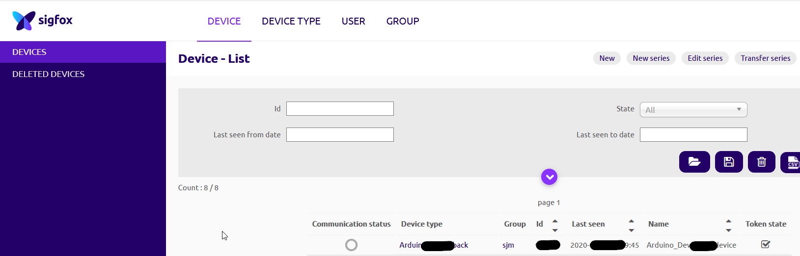 

Vous pouvez cliquer sur l'identifiant __ID__ de l'appareil et accéder aux détails de l'appareil.

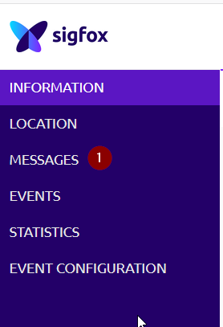

Vous avez dans le menu de gauche __Message__ où vous pouvez cliquer pour voir les détails du message et regarder ce que vous avez envoyé sur le réseau.

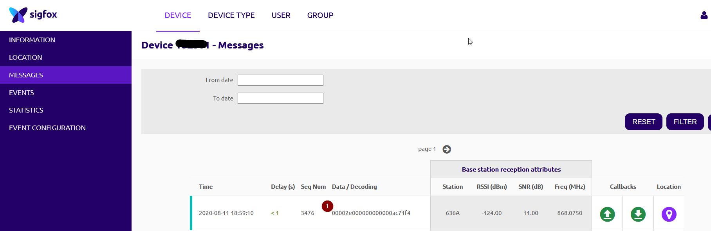

Maintenant, nous avons des données régulièrement envoyées au réseau Sigfox. 

Les données circulent dans les airs vers la station de base (antennes) autour de vous. La station de base analyse le signal radio et décode votre message. Ce message est ensuite poussé vers le [backend Sigfox](https://backend.sigfox.com) où vous pouvez le voir.

Ici, vous voyez la température en hexadécimal 13 signifie 1 * 16 + 3 = 19 ° C

Afficher les informations pour être lisibles par l'homme

### 5.2 Communication bi-directionelle (Pour les curieux !)

Sigfox est un réseau bidirectionnel. Vous pouvez avoir jusqu'à 4 liaisons descendantes par jour depuis le réseau. C'est le minimum que vous pouvez attendre du réseau, mais en gros, vous pouvez demander beaucoup plus. Si la station de base n'a pas épuisé son cycle de service, elle répondra à votre demande de liaison descendante.

Nous allons lancer une réponse de liaison descendante par défaut dans le backend Sigfox. Il s'agit d'un paramètre du type de périphérique. (Device-Type est une configuration appliquée à un groupe d'appareils).

Pour cela, vous devez cliquer sur l'entrée d'en-tête Device Type et sélectionner le type d'appareil correspondant à votre appareil. Cliquez ensuite sur Informations puis sur le côté droit de la page, cliquez sur le bouton Modifier.


Maintenant, nous pouvons éditer la liaison descendante en définissant le mode __DIRECT__ (la valeur est calculée par le backend Sigfox). Ici, nous avons choisi de renvoyer l'horodatage (4 octets) suivi de 4 octets à 0 pour avoir le message attendu de 8 octets.

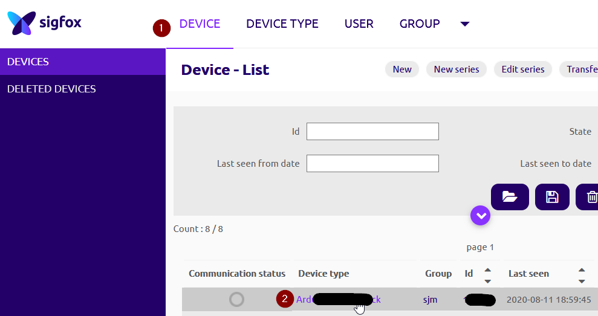
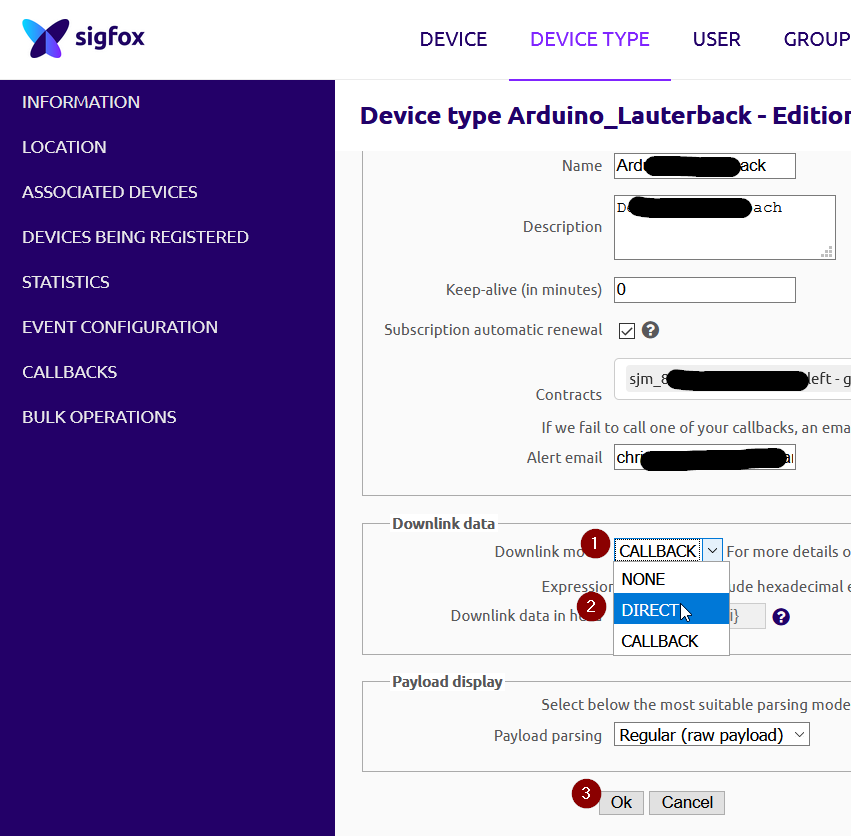

Il faut maintenant modifier le code Arduino pour ajouter la liaison descendante prise en compte:
Pour cela, nous devons simplement ajouter le paramètre __endPacket__ défini avec __true__. Comme le suivant

Voici le nouveau code avec l'ajout en fin de code

```C
#include <RTCZero.h>
#include <ArduinoLowPower.h>
#include <SigFox.h>
#define LED 6         // This is the built_in led
void setup() {
   pinMode(LED,OUTPUT);
   digitalWrite(LED,LOW);
   Serial.begin(115200);
   while (!Serial);
   if ( ! SigFox.begin() ) {
     Serial.println("Error ... rebooting");
     NVIC_SystemReset();
     while(1);
   }
   SigFox.reset();
   delay(100);
   SigFox.debug();
   SigFox.end();

   // Il faut avoir le temps de programmer l'Arduino après une réinitialisation 
   // sinon il ne répond pas en mode basse consommation
   // Sinon, il faut appuyer deux fois rapidement sur reset
   
   Serial.println("Booting...");
   digitalWrite(LED,HIGH);
   delay(5000);
   digitalWrite(LED,LOW);
}

typedef struct __attribute__ ((packed)) sigfox_message {
int8_t temp;
} SigfoxMessage;

void loop() {
   // put your main code here, to run repeatedly:
   SigFox.begin();

   SigFox.status();
   SigfoxMessage msg;
   msg.temp = (int8_t)SigFox.internalTemperature();

   SigFox.beginPacket();
   SigFox.write((uint8_t*)&msg,sizeof(msg));
   SigFox.endPacket(true);
   
   SigFox.beginPacket();
   SigFox.write((uint8_t*)&msg,sizeof(msg));
   int ret = SigFox.endPacket(true);

   if (SigFox.parsePacket()) {
     Serial.println("Response from sigfox backend:");
     while (SigFox.available()) {
       Serial.print("0x");
       Serial.println(SigFox.read(), HEX);
     }
   } else {
     Serial.println("No response from Sigfox backend");
   }

SigFox.end();

   // Wait for 10 minutes.
   // Low Power version - be carefull of bug
   //   LowPower.sleep(10*60*1000);
   // Normal version
   delay(10*60*1000);
}
```

 

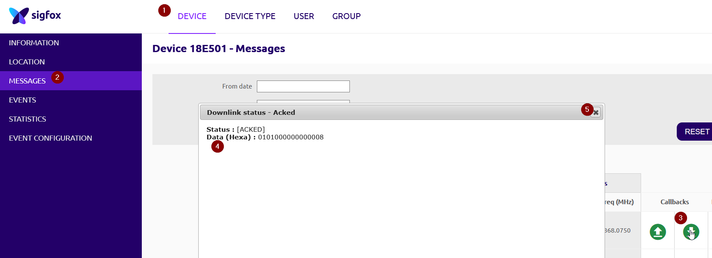

Une fois que vous téléchargez le croquis, vous verrez le voyant clignoter plus longtemps pendant la transmission: après les 5-7 secondes de transmission de données, le voyant continuera à clignoter jusqu'à ce que le réseau Sigfox ait envoyé une réponse de liaison descendante. Cela peut prendre jusqu'à 30-45 secondes.
Normalement, dans la console, vous devriez voir des informations comme les suivantes:
Booting...
Temperature :19
Response from sigfox backend:
0x5B
0x1D
0x7E
0xEA
0x0
0x0
0x0
0x0
Nous pouvons également consulter les messages dans le backend Sigfox et voir l'état de la transmission de la liaison descendante:

En cliquant sur la flèche verte de rappel, l'état de la liaison descendante s'affiche avec les données envoyées à l'appareil.


## 6. Préparation
### 6.1 Récupérer la librairie balance


Avant de récupérer le programme, nous allons ajouter une nouvelle librairie pour mesurer le poids des balances. 

Le fichier __HX711-bta.zip__ télécharger en cliquant sur le lien suivant: [HX711-bta.zip](https://www.dropbox.com/sh/i5s8ciy7g694kg1/AABkwhDlpEFPAKYqyS3tmR65a/libraries/HX711-bta.zip?dl=1) (protégée par mot de passe) 

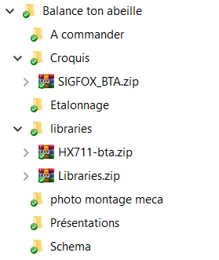 

Télécharger-le.

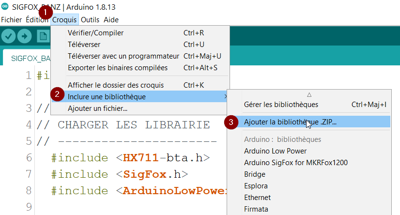

Chercher le fichier __HX711-bta.zip__ récemment télécharger.


### 6.2 Récupérer et réglage du programme

Nous allons récupérer le programme __SIGFOX_BTA.zip__ sur le lien dropbox dans le dossier __Croquis__, en cliquant sur le lien suivant: [SIGFOX_BTA.zip](https://www.dropbox.com/sh/i5s8ciy7g694kg1/AAD01C-2g7-A6q2lOBgPQ6F_a/Croquis/SIGFOX_BTA.zip?dl=1) (protégée par mot de passe) 

 

Télécharger le fichier __SIGFOX_BTA.zip__ et mettez le dans un répertoire : par exemple dans __C:__ ou __D:\Arduino\croquis__

Vous aurez ainsi dans le dossier __Arduino__, deux dossiers: 
__libraries__ : avec toutes les librairies et 
__croquis__ avec vos programmes.

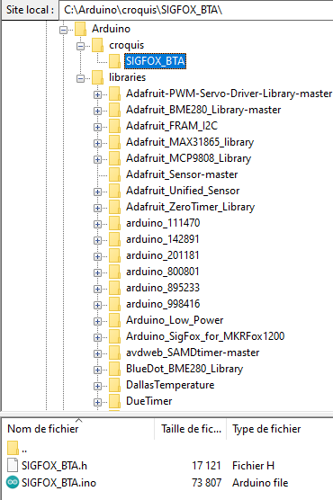

Cliquer droit sur le fichier __SIGFOX_BTA.zip__ et faites __extraire_l'archive__

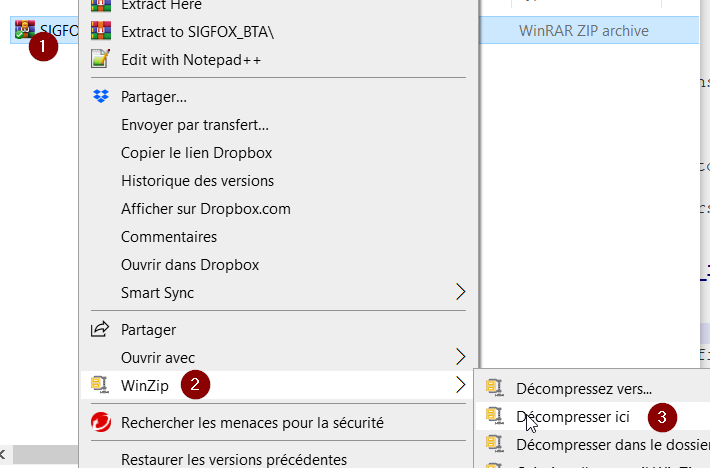

Entrer dans le répertoire __SIGFOX_BTA__

Ouvrer en cliquant deux fois sur le fichier __.ino__ (le fichier .h va s'ouvrir aussi dans le logiciel arduino IDE : il y a deux onglets au dessus de la fenêtre principale)

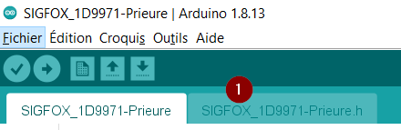

Et tester si tout fonctionne correctement en lançant la compilation (première icône sous Fichier : Vérifier) 

 

Installation du programme sur la carte Arduino

Avant cela il faut désactiver les options pour passer en __mode_étalonnage__

Ouvrer pour cela le fichier .h (il se trouve à côté)

 

Et changer tous les paramètres des lignes qui finissent par `// A MODIFIER`

En y mettant ces valeurs pour le mode étalonnage (cf. [Etalonnage](#7-Etalonnage))

On va commencer les réglages avec une seule balance connectée à la pin A0 (votre première balance); ensuite nous irons plus loin

Pour cela, metter ces valeurs dans le programme SIGFOX_BTA.h, remplacer les valeurs par celle indiquée ci dessous
passer outre les autres valeurs en les laissant tels qu'elles sont. Ces valeurs d'étalonnage sont pour __une__ ruche:

```C

// mode étalonnage pour UNE ruche 
#define NB_A 1 
#define NB_B 0
byte DOUTS[NB_A] = {A0pin};   
byte BOUTS[NB_B] = {};     
String rmqA[NB_A] = {A0rmq};  
String rmqB[NB_B] = {};
#define NB_MESSAGE 1
#define SDISPLAY true
#define ETALONNAGE true
#define TSIGFOX false
#define SLEEP false
#define EEPROM true // (si EEPROM est présente)
#define TYPE_EEPROOM false // (Si l’eeprom fait une erreur, mettez true à la place)
#define INTERNAL_TEMP true
#define VOLTAGE true
```

<details><summary>Cliquez ici pour voir le mode d'étalonnage pour deux ruches</summary>
<p>

```C
// mode étalonnage pour deux ruches 
#define NB_A 1 
#define NB_B 1
byte DOUTS[NB_A] = {A0pin};   
byte BOUTS[NB_B] = {B0pin};     
String rmqA[NB_A] = {A0rmq};  
String rmqB[NB_B] = {B0rmq};
#define NB_MESSAGE 1
#define SDISPLAY true
#define ETALONNAGE true
#define TSIGFOX false
#define SLEEP false
#define TYPE_EEPROOM false // (Si l’eeprom fait une erreur, mettez true à la place)
#define EEPROM true // (si EEPROM est présente)
#define INTERNAL_TEMP true
#define VOLTAGE true
```
</p>
</details>

<details><summary>Cliquez ici pour voir le mode étalonnage pour trois ruches</summary>
<p>

```C
// mode étalonnage pour trois ruches 
#define NB_A 2 
#define NB_B 1
byte DOUTS[NB_A] = {A0pin,A1pin};   
byte BOUTS[NB_B] = {B0pin};     
String rmqA[NB_A] = {A0rmq,A1rmq};  
String rmqB[NB_B] = {B0rmq};
#define NB_MESSAGE 1
#define SDISPLAY true
#define ETALONNAGE true
#define TSIGFOX false
#define SLEEP false
#define EEPROM true // (si EEPROM est présente)
#define TYPE_EEPROOM false // (Si l’eeprom fait une erreur, mettez true à la place)
#define INTERNAL_TEMP true
#define VOLTAGE true
```
</p>
</details>

<details><summary>Cliquez ici pour voir le mode étalonnage pour quatre ruches</summary>
<p>

```C
// mode étalonnage pour quatre ruches 
#define NB_A 2 
#define NB_B 2
byte DOUTS[NB_A] = {A0pin,A1pin};   
byte BOUTS[NB_B] = {B0pin,B1pin};     
String rmqA[NB_A] = {A0rmq,A1rmq};  
String rmqB[NB_B] = {B0rmq,B1rmq};
#define NB_MESSAGE 1
#define SDISPLAY true
#define ETALONNAGE true
#define TSIGFOX false
#define SLEEP false
#define EEPROM true // (si EEPROM est présente)
#define TYPE_EEPROOM false // (Si l’eeprom fait une erreur, mettez true à la place)
#define INTERNAL_TEMP true
#define VOLTAGE true
```
</p>
</details>

<details><summary>Cliquez ici pour voir le mode étalonnage pour six ruches</summary>
<p>

```C
// mode étalonnage pour six ruches 
#define NB_A 3 
#define NB_B 3
byte DOUTS[NB_A] = {A0pin,A1pin,A2pin};   
byte BOUTS[NB_B] = {B0pin,B1pin,B2pin};     
String rmqA[NB_A] = {A0rmq,A1rmq,A2rmq};  
String rmqB[NB_B] = {B0rmq,B1rmq,B2rmq};
#define NB_MESSAGE 1
#define SDISPLAY true
#define ETALONNAGE true
#define TSIGFOX false
#define SLEEP false
#define EEPROM true // (si EEPROM est présente)
#define TYPE_EEPROOM false // (Si l’eeprom fait une erreur, mettez true à la place)
#define INTERNAL_TEMP true
#define VOLTAGE true
```
</p>
</details>

Une fois les constantes changées, vous pouvez téléverser le programme :

S’assurer que la compilation fonctionne
Brancher la prise USB entre l’ordinateur et l’arduino
Sélectionner le port dans le programme arduino


Sélectionner le type de carte : MRKFOX 1200


Après avoir vérifier le code, vous pouvez téléverser le programme dans l'arduino


Le programme fonctionne en mode étalonnage. C'est ce que nous allons faire maintenant.


### 6.3 Préparation de l'étalonnage

Pour faire l'étalonnage, nous avons besoin de différents poids qui vont servir de référence. Là est toute la difficulté : s'assurer que les poids dont nous disposons sont à la bonne valeur. 

Sachant que nous cherchons une précision absolue au kilo, et une précision relative à 100g, nous ne sommes pas trop regardant sur le poids. 

Prenez votre pèse personne et servez-vous en comme référence. 

Nous avons donc besoin de plusieurs poids
#### 6.3.1 un poids entre 5 et 20 kg : ce sera notre limite basse

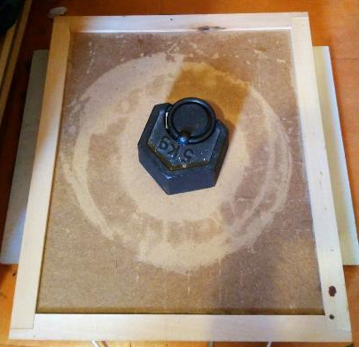

__la_ruche__
J'ai aussi opté pour une ruche avec des cadres de cire gauffré qui servira de base pour positionner la balance. Il faut donc aussi la peser sur notre pèse personne. C'est pas si facile, car une fois posé, on ne voit plus le cadran ; je pose de taquet qui la surélève et je peux ainsi voir le cadran. mais je dois aussi utiliser les taquets dans mon etalonnage, à moins de les peser et de retirer leur poids. 
Vous pouvez aussi portez la ruche et vous peser avec, puis vous pesez sans. La différence sera le poids de la ruche


#### 6.3.2 un poids important de plus de 50 kilo ; ce sera la limite haute

__Les_seaux__
j'ai opté pour des sauts remplis d'eau que je peux empiler. Je pose mes sauts sur le pèse personne, je les numérotes et je pèse dans les différentes configurations.

Exemple : 
seau 1 : 14,98 kg 
seau 2 : 14,95 kg
seau 3 : 14,94 kg
seau 4 : 14,96 kg
poids 1 = seau 1
poids 2 = seau 1 + seau 2
...
poids n = seau 1 + seau 2 + seau 3 + seau 4

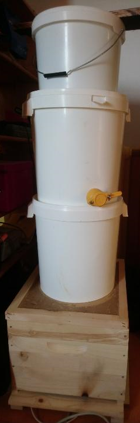

#### 6.3.3 des poids intermédiaires pour affiner la mesure

Vous pouvez préparer d'autre poids qui serviront à affiner la mesure. 

En effet le programme d'étalonnage va calculer une droite de régression linéaire, c'est à dire qu'il va calculer une droite qui passe au plus prêt de tous les points mesurés.

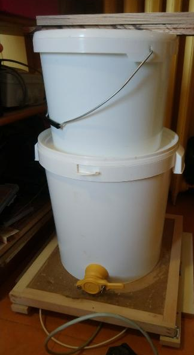


#### 6.3.4 Remarques 
 
Remarque 1. __Important__ Assurez-vous que la balance à étalonner soit bien horizontale à l'aide d'un niveau.

Remarque 2. la balance à vide représente déjà un poids nul. 

Remarque 3. En ce qui concerne le poids haut, plus il sera grand et précis, plus la droite sera précise dans les hautes valeurs.

Remarque 4. Ce qui nous intéresse vraiment, c'est le poids située entre 15 et 50 kilos ; 15 étant la limite basse (pas de nourriture) et 50 début de miellée. L'idée étant de chercher des poids dans cette zone. 

Remarque 5. Une fois les 80 kilos dépassés, on n'est pas au gramme prêt ! 

Remarque 6. Idéalement, il faut que ces références soient stables car ces poids serviront pour étalonner toutes les balances. Ce qui est réalisable entre la ruche et les sauts.

Remarque 7. les capteurs sont sensibles au fluage (Déformation lente et retardée d'un corps soumis à une contrainte constante) de l'ordre de 200 grammes ; pour bien faire l'étalonnage, je vous conseille de poser l'ensemble des poids sur la balance durant un certain temps (~30min) ; ainsi vous serez en condition réelle. vous aurez ainsi pris en compte l'affaissement des capteurs.


## 7. Etalonnage

Munissez-vous de ce tableau où vous allez reporter les valeurs d'étalonnage


Vous trouverez ce tableau dans le dropbox/etalonnage 

1. Brancher votre balance à l'entrée 1 de votre boitier principal
2. Brancher la batterie 
3. Brancher le cable USB
4. Ouvrir le moniteur

 

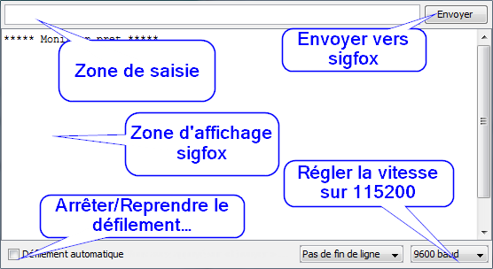 

les données propres à l'arduino devrait s'afficher ainsi que le nombre de balance.

Arduino va vous poser des questions :

5. Assurez-vous que rien ne pose sur la balance que vous allez étalonner. en effet, on va commencer à vide avant de mettre le poids. (une première valeur à 0 kg sera enregistrée)

 

__Channel_(A/B)__ ? si votre balance est branchée sur les entrées A+/A-, alors dites A, sinon B (B+/B-). Par exemple taper __A__ ou __B__ (en majuscule)

N° de PIN ? selon la balance que vous allez connecter, dans notre exemple taper __0__ 

<details><summary>Cliquer ici pour voir la liste des entrées possibles</summary>
<p>

```C
Boitier principal 
L'entrée 1 : A puis 0
L'entrée 2 : B puis 0
L'entrée 3 : A puis 1
L'entrée 4 : B puis 1

Extension 1 
L'entrée 1 : A puis 2
L'entrée 2 : B puis 2
L'entrée 3 : A puis 3
L'entrée 4 : B puis 3
L'entrée 5 : A puis 10
L'entrée 6 : B puis 10

Extension 2 :
L'entrée 1 : A puis 4
L'entrée 2 : B puis 4
L'entrée 3 : A puis 5
L'entrée 4 : B puis 5
L'entrée 5 : A puis 8
L'entrée 6 : B puis 8
```

</p>
</details>

__Poids_maxi__ : le poids maxi est entre 120kg et 200kg, plus cette valeur est élevée, moins ce sera précis. La précision est de PMAXI/4096 : Mais si vous mettez un poids maxi trop faible et que la balance dépasse, la valeur arrivera à saturation numériquement parlant. Par exemple, si vous mettez 150kg, la précision numérique sera de 36g. et si vous mettez 200, alors ce sera 48g..

__P1__
Une fois le poids maxi indiqué, il va faire le zero, et puis vous demander de d'ajouter un poids entre 0 et 30kg (votre premier poids référence P1).

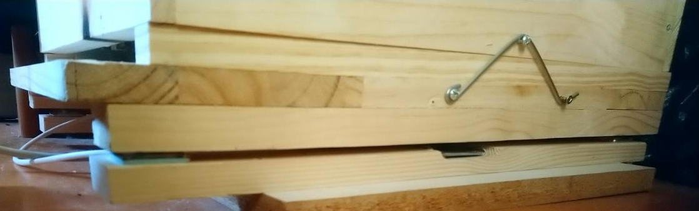

 

Une fois le poids P1 posé, entrer la valeur avec un chiffre après la virgule dans le moniteur puis __Entrée__

__P2__
Ensuite, il demande le poids P2 (>50kg). Poser ce poids sur la balance de manière que le poids soit répartie de manière égale sur les 4 capteurs. 

Evidemment, vous pouvez vous aider d'une ruche vide comme référence et ainsi poser les poids supplémentaire dessus. 


Saisissez la valeur avec un chiffre après la virgule, c'est suffisant. puis __Entrée__

Il va calculer les valeurs de l'étalonnage : 

valeur mini, valeur maxi, coefficient, et constante.

__mini__ et __maxi__ correspondent au valeur brut du capteur respectivement à P0 et PMAXI kg ; et ainsi à calculer la valeur qui sera envoyé via sigfox. 

Alors que __coefficient__ et __constante__ servent à convertir la valeur envoyée par sigfox en kg. 

Poids = coefficient * valeur_sigfox + constante 

Notez bien ces valeurs sur la feuille d'étalonnage, et sur la partie des constantes du programme (cf. ci dessous)

si l'Eeprom est brancher, il vous propose de sauvegarder les résultats sur l'Eeprom. Taper __save__ 

Une fois cela fait, les valeurs enregistrées seront affichées.

Nous allons dans tous les cas reporter ces valeurs dans la partie du programme où il y a les constantes. (fichier .h)

Choisisser dans la liste des constantes la section correspondante au numéro de PIN et à la channel A ou B. Vous allez entrer vos valeurs au fur et à mesure

```C
// juste une remarque : quand il y a "//" cela veut dire que c'est un commentaire. Cette partie ne sert que la compréhension, mais pas le programme
// 1er exemple
//  ----   A ------ indiquer le numéro de channel
// ORDRE 0 - Boitier principal ENTREE 1 // indiquer le numéro de PIN, le boitier, la balance, la ruche...
  #define A0pin  0 // N° de PIN
  const char A0rmq[] =  "[indiquer le numéro de votre ruche] - Boitier 0 - Entrée 1";
  #define A0mini 395820 // indiquer la valeur mini recemment calculée
  #define A0maxi 5036865 // indiquer la valeur maxi recemment calculée
  const float A0alpha = 0.0488; // indiquer le coefficient recemment calculé
  const float A0beta = 0.0032; // indiquer la constante recemment calculé
```   

__Px__
Avant de passer au prochain étalonnage, vous pouvez entrer de nouveaux poids. 

Arduino calcul une droite de régression linéaire. C'est-à-dire la droite qui passe au plus prêt des points entrés. Plus il y a de valeurs, plus la droite sera précise.


Vous pouvez continuer avec d'autres valeurs.
 
Une fois cela effectuer, vous pouvez taper __save__ de nouveau pour bien sauvegarder vos résultat ; n'oublier pas de noter les valeurs mini,maxi,coefficent,constante 

__next__
et ensuite taper __next__ et passer à l'étalonnage suivant.


__Sortir_du_mode_étalonnage__
Une fois terminé et si vous voulez vérifier alors changer ces constantes dans le programme .h
```C
#define ETALONNAGE false     // A MODIFIER
```
__Téléverser_le_programme__
et observer à l'écran les valeurs des différentes balances qui vont s'afficher sur le moniteur


__Mode_production__
Pour passer en mode production. Il faut d'abord configurer le backend sigfox et le site balances.serviteurs.org (ou une autre solution qui accueillera les données)
changer uniquement ces constantes en gardant les autres telles quelles 

Une fois téléversé, vous pouvez retirer la prise USB avec les précautions d'usage.

__MODE_PRODUCTION__
```C
#define TSIGFOX true     // A MODIFIER
#define SLEEP true     // A MODIFIER
#define SDISPLAY false     // A MODIFIER
#define ETALONNAGE false     // A MODIFIER
```

ou un test intermédiaire où vous n'activez pas de suite l'endormissement du Sigfox mais vous envoyé vos données au backend Sigfox. Ainsi :

__MODE_PRODUCTION_INTERMEDIAIRE__
```C
#define TSIGFOX true     // A MODIFIER
#define SLEEP false     // A MODIFIER
#define SDISPLAY false     // A MODIFIER
#define ETALONNAGE false     // A MODIFIER
```


Quand votre Sigfox est en production : Si vous devez changer des paramètres et re-télerverser le programme, n'oubliez pas d'appuyer deux fois rapidement sur le bouton reset. Cela remet le programme à zero, mais surtout cela sort Sigfox de son sommeil (où il n'est pas capable de communiquer !)

Ce mode sommeil sert à consommer peu d'énergie durant les temps d'inaction. Seul l'horloge interne fonctionne et les interruptions par timer ou par bouton poussoir.


## 8. Site balances
### 8.1 Créer un compte
Avant d'attaquer la configuration du site qui va afficher les poids des balances. Il faut déjà créer un compte sur ce site
rendez-vous sur https://balances.serviteurs.org
Puis cliquer sur parrainer une ruche

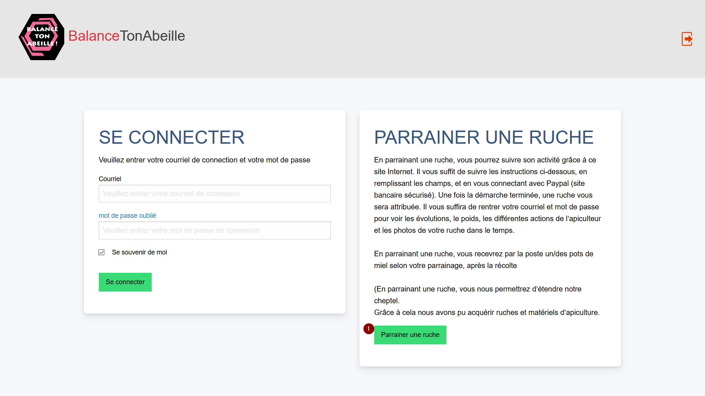

remplisser vos coordonnées, 

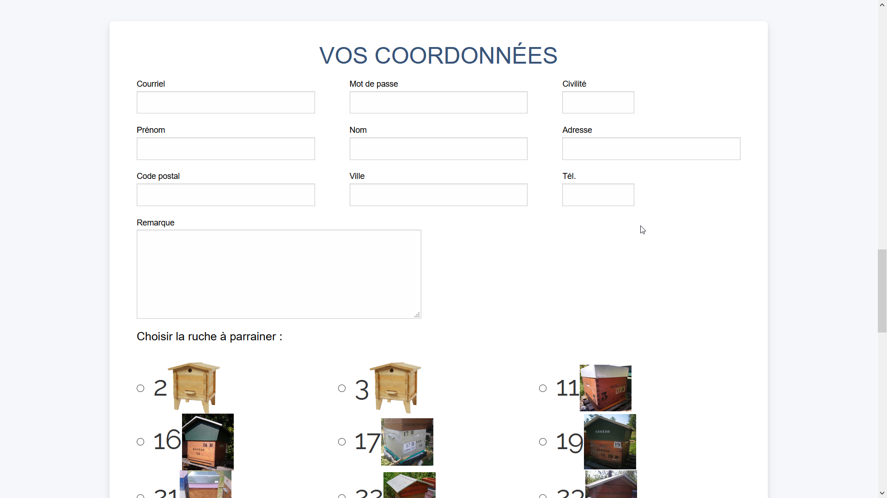

indiquer un montant dans la colonne paypal. 

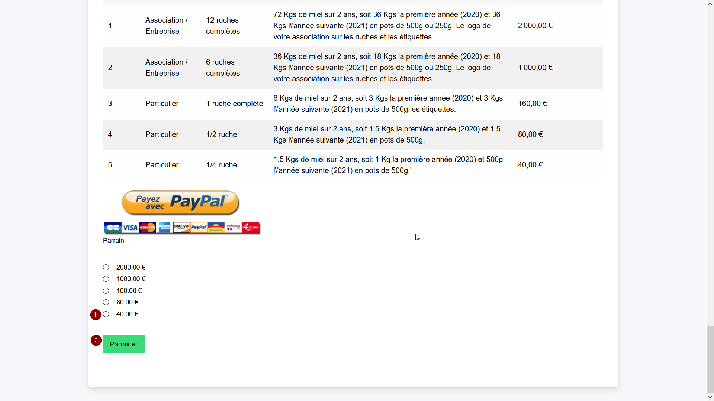

Vous serez rediriger vers Paypal, mais à ce moment là, __ANNULER TOUT__. Entre temps, votre compte aura été créé. Envoyer moi un mail, je pourrai ainsi __upgrader__ votre compte comme __Administrateur__. Vous pourrez ainsi administrer vos balances en vous connectant avec votre courriel et mdp

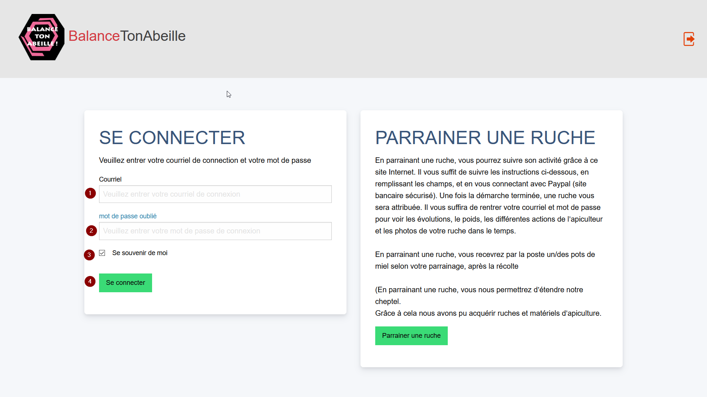


Deuxième chose à faire avant de remplir les champs :
Récupérer la __feuille d'étalonnage__ avec les données que vous avez récoltées. 

### 8.2 Remarques
Une petite parenthèse s'impose. En effet, Sigfox envoi un message de 12 octets (12 caractères : ABCDEFGHIJKL), 12x8bit ou 24 hexa ou 96bits : notre système obtimise cela en compressant les données de manière à entrer le maximum d'information dans un message. Et si un message ne suffit pas, on en envoi un deuxième, puis un troisième.
 
Le message est ainsi constitué, vous trouverez les correspondances entre les pins du MRK, l'emplacement du message, le numéro de message, le boitier (principal ou extension). 
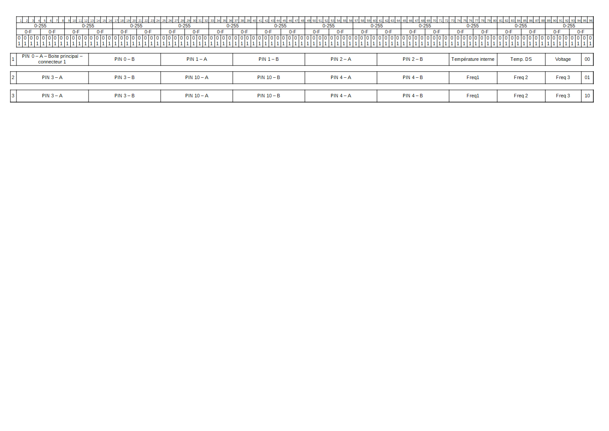
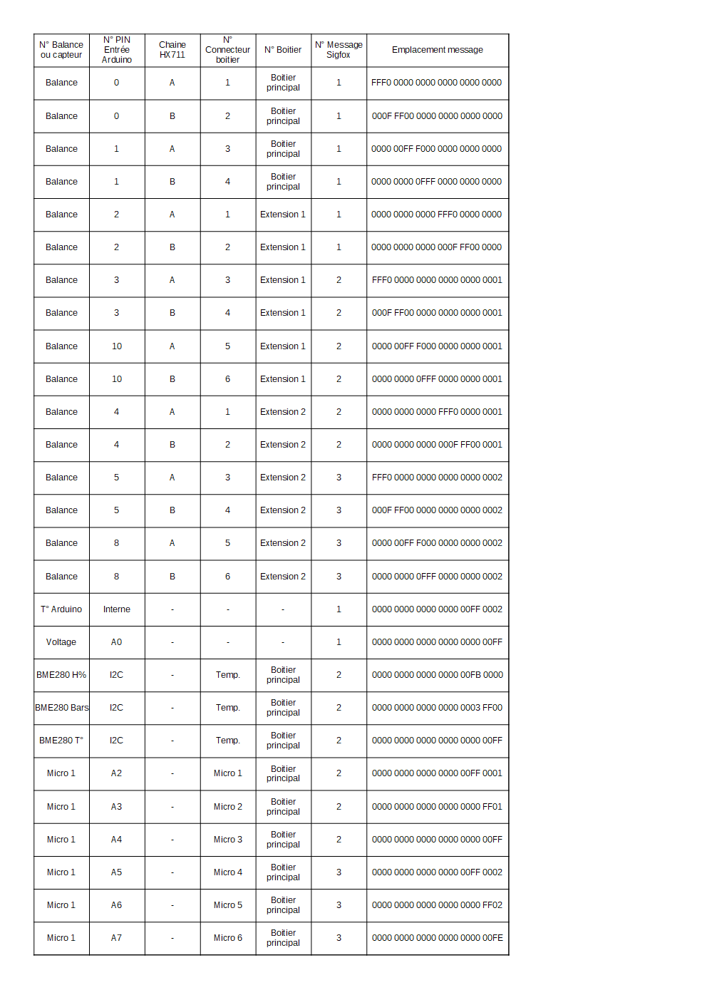

Une fois que vous avez compris cela, vous pouvez passer au réglages des balances, ruches, emplacement, sigfox côté web ci dessous. 

### 8.3 Ajouter une balance

#### 8.3.1 Ajouter une balance (capteurs)
Il suffit de vous rendre dans le menu administrateur du site balances.serviteurs.org, une fois votre compte upgrader

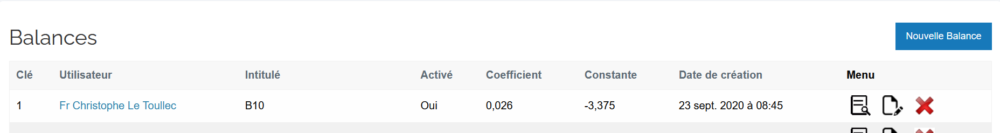

Ajouter une nouvelle balance ; 

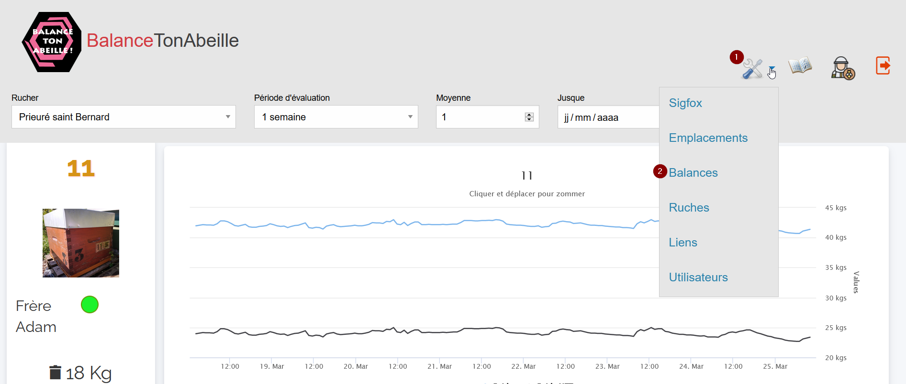
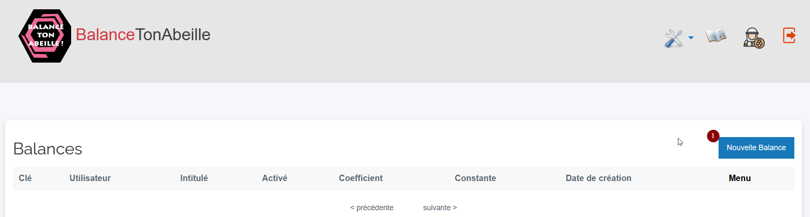


en fait, ce titre de balance est un peu erroné, car il correspond de manière plus large aux capteurs branchés (capteurs de poids, capteur de température, mesure de voltage, capteur humidité, registre...)

On va entrer le coefficient et la constante qui a été calculé lors de l'étalonnage. On met un intitulé.

__Intitulé__ : Donner un nom ou plutot une sorte de numéro de serie pour cette balance. Par exemple __B-A-001__. __B__ pour balance, __A__ pour dire que cette balance a été étalonner sur une channel A. et le numéro d'ordre pour la balance 1. Marquer au feutre aussi votre balance. Vous aurez ainsi une correspondance entre le logiciel et votre balance physique. Si vous êtes amené à déplacer cette balance, vous saurez numériquement parlant à quoi elle correspond. En veillant, dans notre cas, à la connecter à une channel A. pour la deuxième balance, dans la même logique, vous pourrez indiquer __B-B-002__ ...

__Activé__ cocher la case pour activer cette balance

__Coefficient__ indiquer ici le coefficient relevé durant l'étalonnage

__Constante__ indiquer la constante relevé durant l'étalonnage

__Ajouter__ pour sauvegarder

#### 8.3.2 Ajouter d'autres capteurs (menu balance)
Pour __Temperature_Sigfox__, on entre intitulé = Temperature Sigfox, coefficient = 0,333 et constante = -30
Pour __voltage_%__, on entre intitulé = Voltage %, coefficient = 0,39 et constante = 0 ;


### 8.3 Ajouter une ruche

Ajouter une ruche, On entre toutes les caractéristiques de la ruche, ainsi que le poids du toit, des hausses à vide et le poids du corps de ruche à vide. (à vide, c'est-à-dire avec les cadres gauffrés construit sans miel ni pollen si possible) ; ainsi le poids net correpondra au poids en miel, pollen, et abeilles.


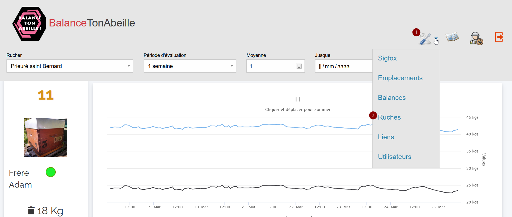
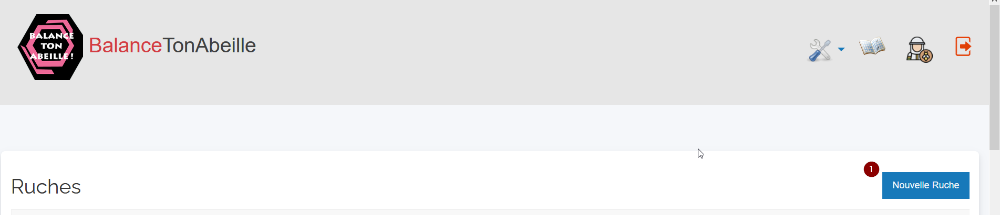
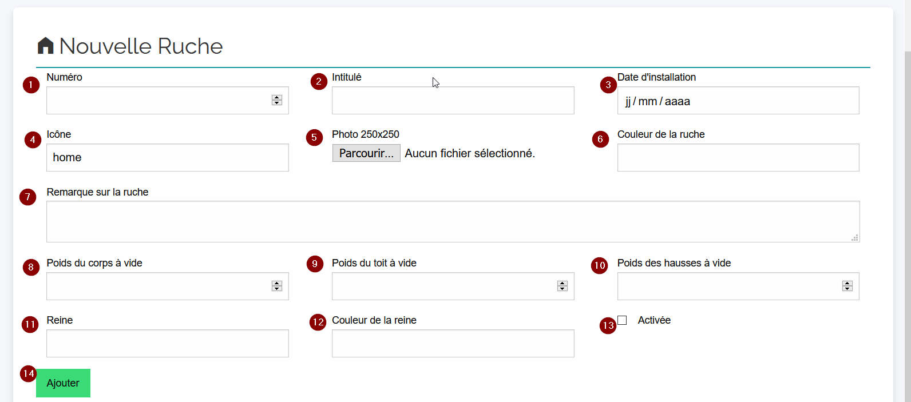


### 8.4 Ajouter un Sigfox
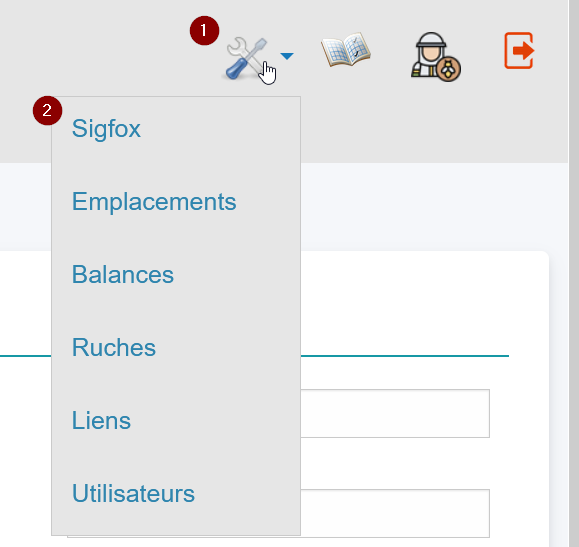
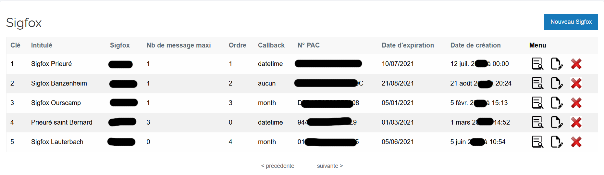

On entre le __N°ID__ sans les 0 avant en tout en majuscule.
On entre le Nouveau __N°PAC__ (cf. fiche information du device sur le site backend.sigfox.com)
On entre __callback__, ici datetime ; ca veut dire qu'une fois par jour, le site web enverra vers le sigfox la date et l'heure au sigfox.
Nombre de message : selon le nombre de balance connecté au sigfox (1 pour 1 à 4 balances ; 2 pour 5 à 12 balances ; 3 au delà)
Indiquer la date d'expiration (1 an après la premier envoi) pour le renouvellement cf. renouvellemnet d'abonnement.


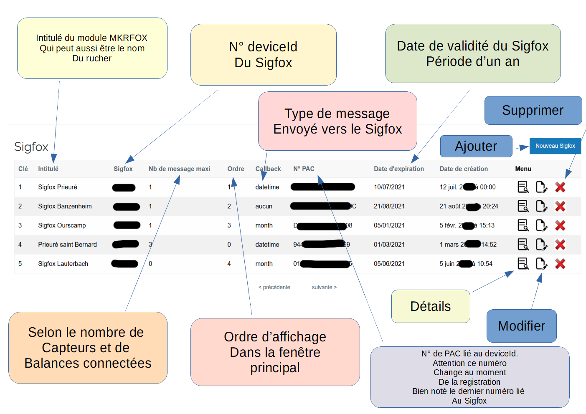

### 8.4 Ajouter les emplacements
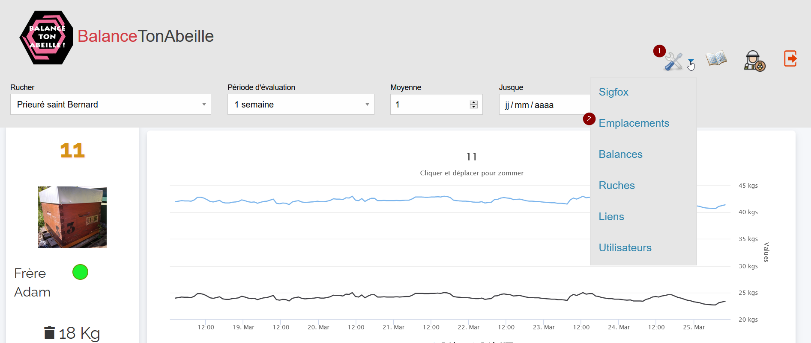
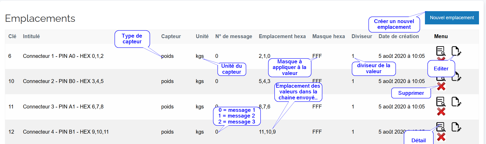

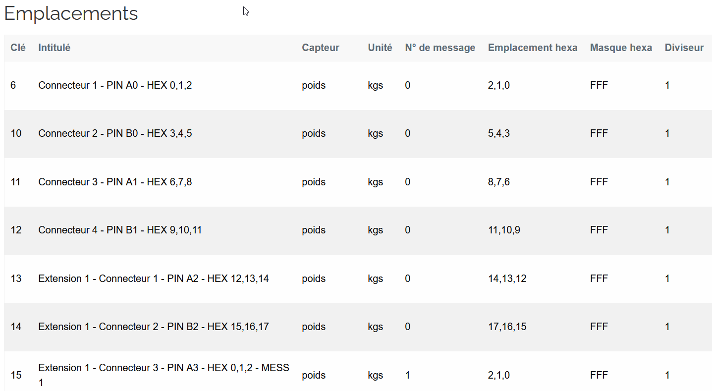
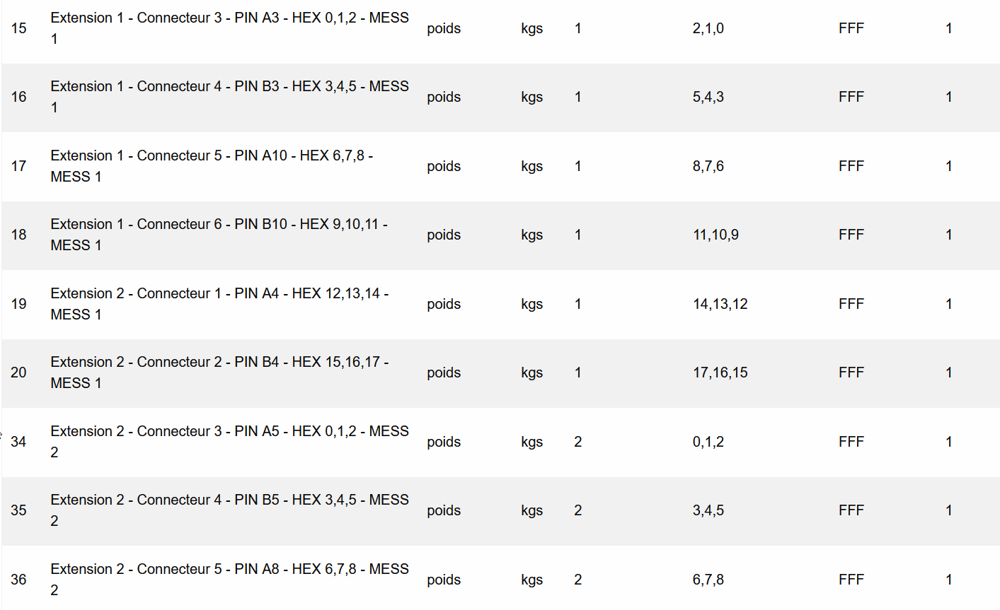

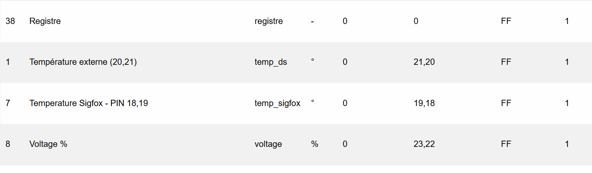

Cette grille vous donne les caractéristiques à entrer pour les emplacements selon le nombre de balance, capteur.

### 8.5 Ajouter un lien
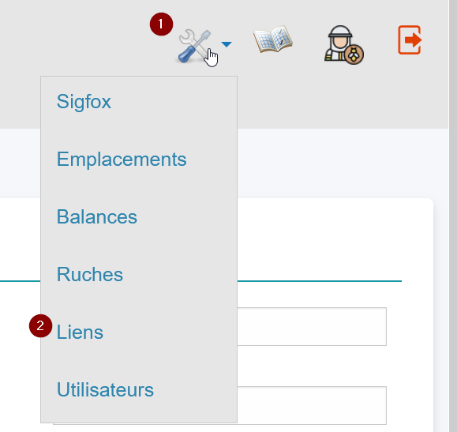
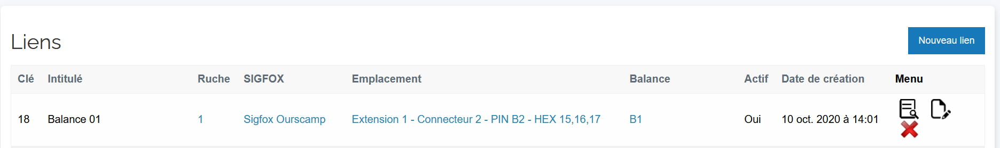


## 9. Configuration backend sigfox
Connecter vous à votre compte sigfox sur le site https://backend.sigfox.com


Dans le Menu supérieur, cliquer sur __Devices__ Vous arrivez normalement à la liste de vos sigfox comme suit


Dans le tableau des sigfox, cliquer sur le champ de la colonne __device type__. Vous arrivez à la page du device type comme suit

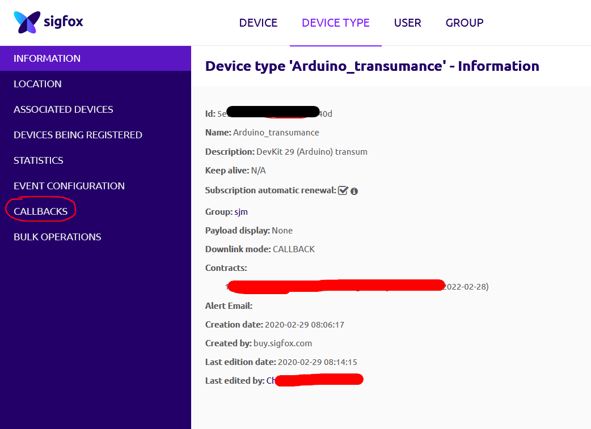

Cliquer sur __Callback__ dans le menu de gauche

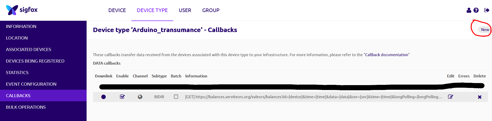

Cliquer sur __new__ en haut à droite. 

Plusieurs options sont possibles. Je vous propose d'acheminer vos données vers balances.serviteurs.org mais vous pouvez choisir d'autres site web à votre convenance.

Pour configurer vers balances.serviteurs.org
Cliquer __CUSTOM CALLBACK__

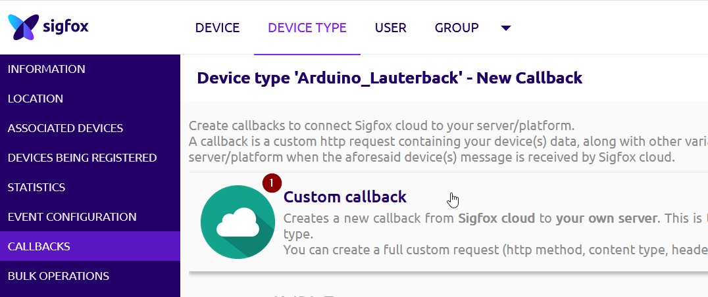

Nous allons définir une nouvelle règle : que doit faire sigfox quand les données arrivent depuis le module MKR.

Nous allons définir les différentes options


__Type DATA BIDIR__

__CHANNEL  URL__

__Url pattern : https://balances.serviteurs.org/valeurs/balances?id={device}&time={time}&data={data}&snr={snr}&time={time}&longPolling={longPolling}&seqNumber={seqNumber}&ack={ack}__

__Use HTTP method GET__

__cocher send SNI__

Cliquer sur __OK__

Vous retourner sur la liste des callbacks, cliquer sur le point blanc de la colonne downlink -> devient un point noir. Le downlink est activé : c-a-d que le sigfox fonctionne maintenant dans les deux sens : montant et descendant.

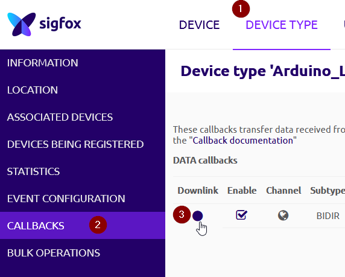

Cliquer sur __Information__ du menu de gauche 

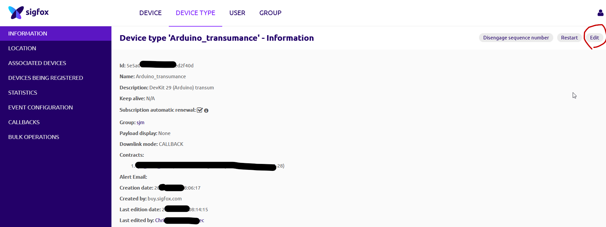

puis __edit__ dans le menu en haut à droite 

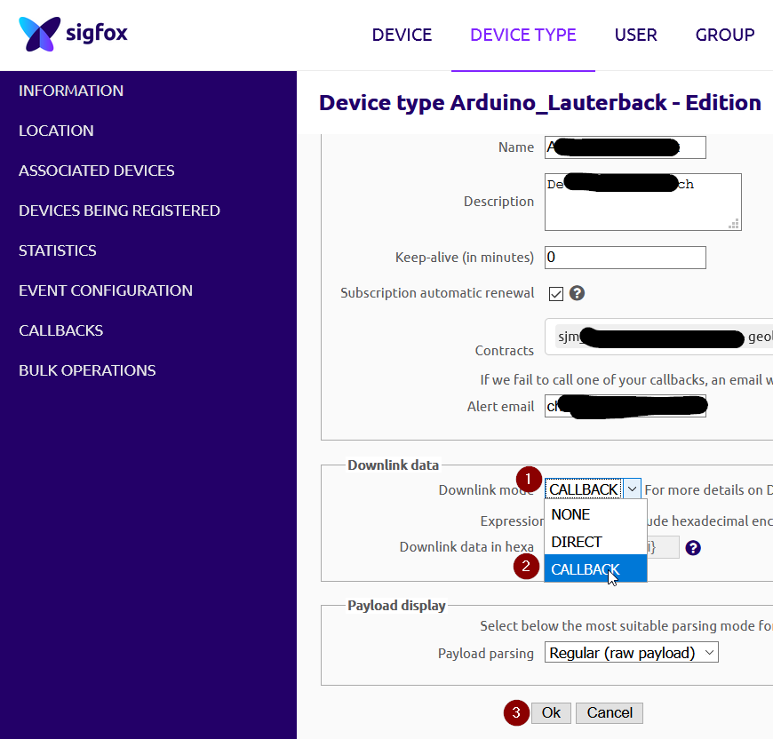

Dans le block __Downlink mode : CALLBACK__

Vous pouvez changer le nom pour plus de clarté dans __Name__ et ajouter une description dans __description__ 

et __Payload display__ sur __Regular (raw payload)__

Terminer par __OK__

Maintenant, toutes les informations provenant du MKR transiteront par le backend Sigfox, les données resteront enregistrées, puis seront acheminer vers https://balances.serviteurs.org que vous avez configuré

## 10. Renouvellement de l’abonnement après un an
L’abonnement dure un an, après un an, il faut renouveler le contrat : 
Aller sur le site des [offres de sigfox](https://buy.sigfox.com/buy/offers/FR)

Connectez-vous grâce à votre courriel et mot de passe sigfox enregistré lors de votre premier enregistrement.


Choisir le nombre de contract sigfox à contracter.

Choisir 140 messages et cliquer sur BUY

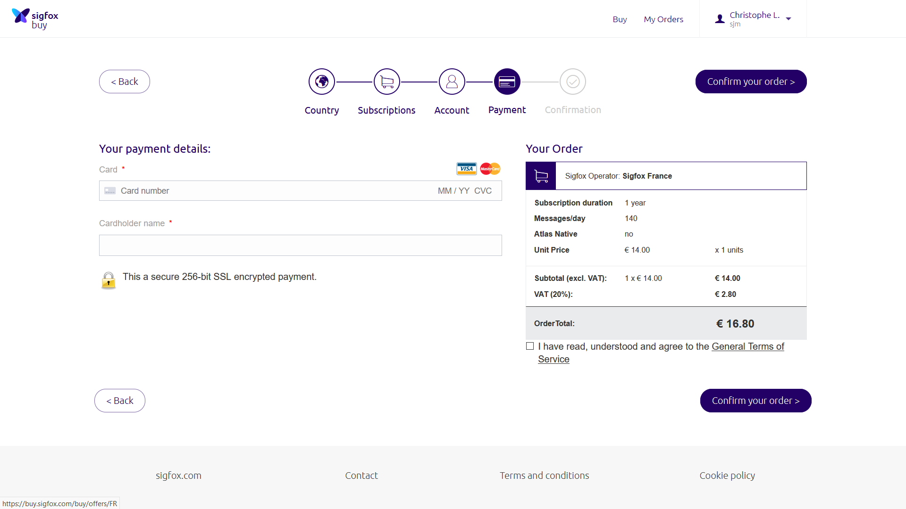

Une fois le contrat acheté, nous allons voir la liste des [contrats en cours](https://backend.sigfox.com/contractinfo/list)

Noter le nouveau nom du contrat que vous venez d’acheter grâce à la date de création.

Ensuite aller dans la [page deviceTYpe](https://backend.sigfox.com/devicetype/list)


Cliquer Description et sélectionner Edit
 
Dans le champ « contrat » sélectionner le contrat récemment activé

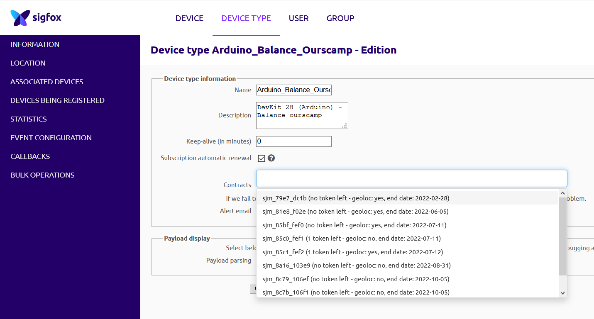

Après « OK », Il faut faire un restart

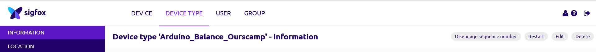

Normalement votre Sigfox fonctionne de nouveau
